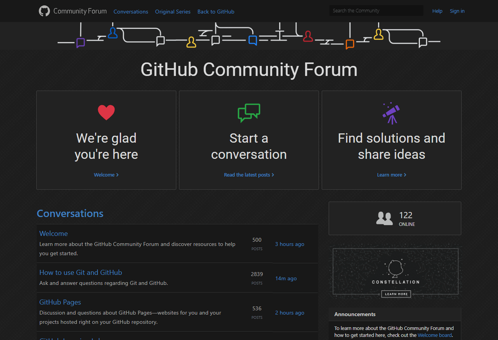

  
   
  
  
  
  
  

## Preview

## Installation

A userstyle extension is required, common ones include:

🎨 Stylus for [Firefox](https://addons.mozilla.org/en-US/firefox/addon/styl-us/), [Chrome](https://chrome.google.com/webstore/detail/stylus/clngdbkpkpeebahjckkjfobafhncgmne) or [Opera](https://addons.opera.com/en-gb/extensions/details/stylus/). 
🎨 xStyle for [Firefox](https://addons.mozilla.org/firefox/addon/xstyle/) or [Chrome](https://chrome.google.com/webstore/detail/xstyle/hncgkmhphmncjohllpoleelnibpmccpj).

Then:

📦 [Install the usercss](https://github.com/StylishThemes/Wikipedia-Dark/raw/master/wikipedia-dark.user.css) with Stylus or FreeStyler. Supports automatic updates.

## Available Syntax Highlighting Themes ([Demo](https://stylishthemes.github.io/GitHub-Dark/))

| Theme                      | GitHub |
|----------------------------|:------:|
| Ambiance                   |   ✔️    |
| Chaos                      |   ✔️    |
| Clouds Midnight            |   ✔️    |
| Cobalt                     |   ✔️    |
| GitHub Dark                |   ✔️    |
| Idle Fingers               |   ✔️    |
| Kr Theme                   |   ✔️    |
| Merbivore                  |   ✔️    |
| Merbivore Soft             |   ✔️    |
| Mono Industrial            |   ✔️    |
| Mono Industrial Clear      |   ✔️    |
| Monokai                    |   ✔️    |
| Monokai Spacegray Eighties |   ✔️    |
| Obsidian                   |   ✔️    |
| One Dark                   |   ✔️    |
| Pastel on Dark             |   ✔️    |
| Solarized Dark             |   ✔️    |
| Terminal                   |   ✔️    |
| Tomorrow Night             |   ✔️    |
| Tomorrow Night Blue        |   ✔️    |
| Tomorrow Night Bright      |   ✔️    |
| Tomorrow Night Eighties    |   ✔️    |
| Twilight (**default**)     |   ✔️    |
| Vibrant Ink                |   ✔️    |

- Please provide a pull request if you have or want to create a missing theme.

## Contributions

If you would like to contribute to this repository, please...

1. 👓 Read the [contribution guidelines](./.github/CONTRIBUTING.md).
1.  [Fork](https://github.com/StylishThemes/GitHub-Community-Dark/fork) or  [download](https://github.com/StylishThemes/GitHub-Community-Dark/archive/master.zip) this repository.
1. 👌 Create a pull request!

Thanks to all that have [contributed](./AUTHORS) so far!
